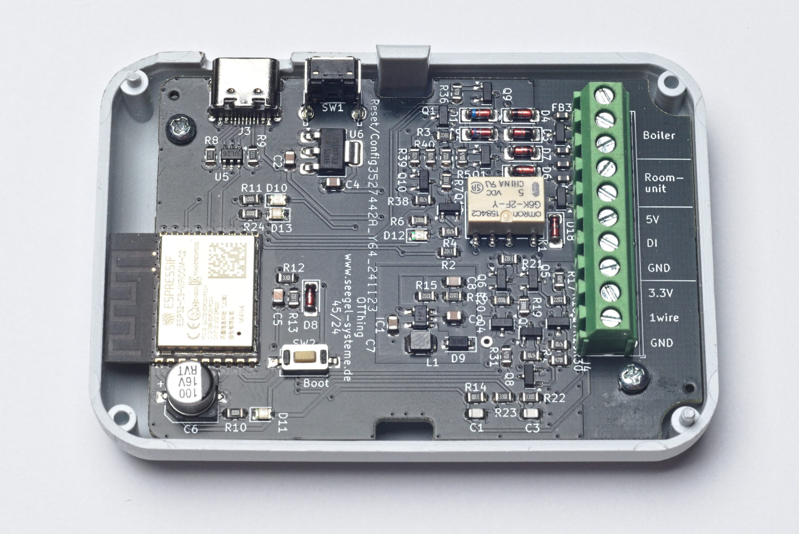
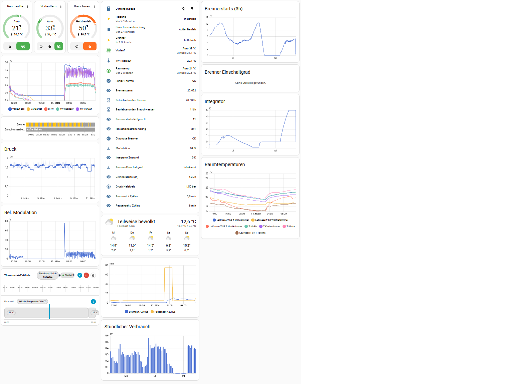
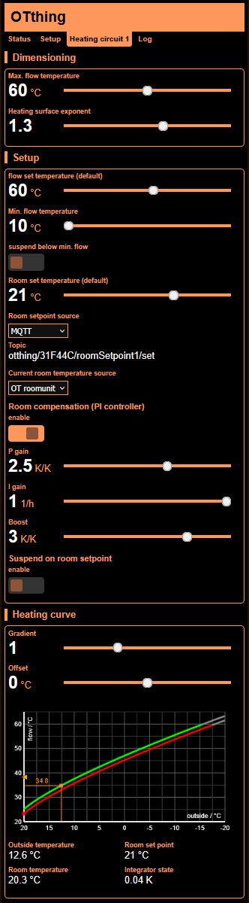
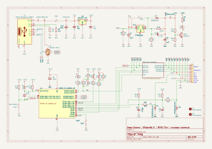
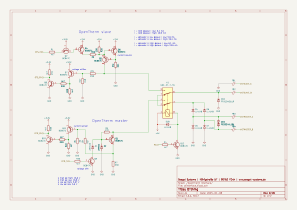

# OTthing
**a compact WiFi <-> OpenTherm (master & slave) interface**

## Project homepage
https://www.seegel-systeme.de/2025/01/05/ot-thing-das-universelle-wifi-opentherm-interface/

## schematics

## discussion
https://community.home-assistant.io/t/ot-thing-an-opentherm-wifi-gateway-with-integrated-ot-master-slave/824667

## Reporting issues
When reporting issues please supply:
* Brand & model of boiler & roomunit
* Log
* status JSON (http://[OTTHING-IP]/status)
* configuration JSON (http://[OTTHING-IP]/config)
* OT status JSON (http://[OTTHING-IP]/otitems)
