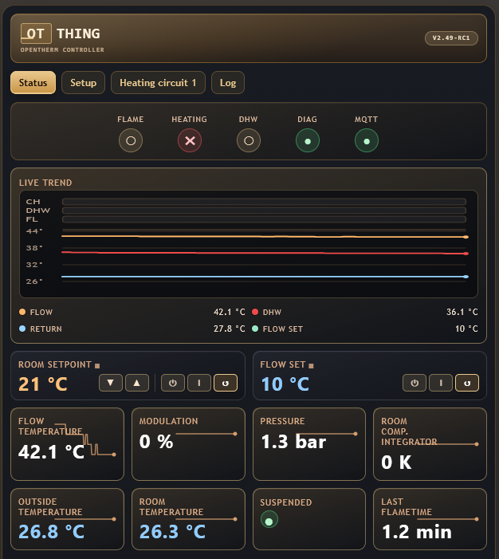

# OTthing
**a compact WiFi <-> OpenTherm (master & slave) interface**

## Project homepage
https://www.seegel-systeme.de/2025/01/05/ot-thing-das-universelle-wifi-opentherm-interface/




## Overview

OTthing is a versatile OpenTherm gateway that bridges your heating system to the Internet via WiFi. It acts as an OpenTherm master (controlling your boiler) and/or slave (integrating with room thermostats), providing real-time monitoring and control through a modern web interface and Home Assistant integration.

### Key Features

* **Dual OpenTherm Modes**: Operate as both OpenTherm master and slave simultaneously
* **Single-Board Compact Design**: Cost-efficient SMD-based one-board hardware with small enclosure footprint
* **Broad HVAC Compatibility**: Designed for OpenTherm-enabled boilers, heat pumps, ventilation, solar storage, and similar systems
* **USB-C Powered**: Simple and reliable power supply through a standard USB-C connector
* **Web Dashboard**: Real-time status monitoring with system metrics
* **Home Assistant Integration**: Native MQTT discovery and seamless HA integration
* **Multi-Zone Support**: Control up to 2 heating circuits with independent parameters
* **Time Program**: Built-in scheduling for automatic heating setpoint changes
* **Heating Curve Control**: Outdoor-compensated flow temperature control with configurable curve parameters
* **Flow & Setpoint Management**: Fine-grained control for CH temperature targets, modes, and operating limits
* **Raw OpenTherm Tools**: Direct read/write request endpoint for diagnostics and advanced integrations
* **Real-Time Telemetry**: Live updates via WebSocket for logs and status changes
* **REST API**: Full HTTP interface for status, configuration, control commands, and topic discovery
* **WiFi Provisioning**: Built-in network scan and credential setup through the web interface
* **OTA Firmware Update**: In-browser firmware upload endpoint with automatic reboot on success
* **Local Data Export**: Device data and diagnostics export from the web UI for troubleshooting
* **External Inputs & Sensors**: Optional DS18B20, pulse input, or photointerrupter support (for example condensate monitoring)
* **Selectable Operating Strategies**: Run OTThing as full heating controller or in monitoring-first mode for telemetry-only operation
* **Automatic Bypass Behavior**: Allows restoring conventional room-thermostat operation without rewiring
* **Failsafe Runtime Status**: Device health and communication state tracking for robust operation
* **Local Control**: Responsive web UI with no cloud dependency
* **Modular Design**: Extensible architecture supporting multiple integrations
* **Open Source Platform**: Open hardware and firmware for custom extensions and modifications
* **Advanced Configuration**: Room modes (off/heat/auto), flow control, heating curves, and more
* **Detailed Logging**: Real-time log streaming to monitor system behavior

## Architecture

The firmware consists of several functional modules:

* **OpenTherm Control** (`otcontrol.cpp`): Manages master/slave communication with the boiler
* **Master Requests** (`masterrequests.cpp`): Builds and schedules OpenTherm master requests and polling cycles
* **OpenTherm Values** (`otvalues.cpp`): Stores, normalizes, and exposes decoded OpenTherm data points
* **Heating Curve** (`heatingcurve.cpp`): Calculates target flow temperature from heating-curve parameters
* **MQTT Integration** (`mqtt.cpp`): Publishes device state and subscribes to control topics
* **Device Status** (`devstatus.cpp`): Tracks runtime health, connectivity, and status flags
* **Auxiliary Input** (`auxInput.cpp`): Handles external input signals for additional control logic
* **Web Portal** (`portal.cpp`): Serves the responsive dashboard and API endpoints
* **Heating Control** (`CHcontrol.cpp`): Manages heating circuits, setpoints, and modes
* **Sensor Integration** (`sensors.cpp`): Collects data from external sensors
* **Configuration Management** (`devconfig.cpp`): Handles persistent device settings

## Hardware

* **MCU**: ESP32-C3 (or compatible with UART pins)
* **Communication**: OpenTherm interface
* **Power**: via USB
* **Optional**: 1wire temperature sensors DS18B20, auxiliary inputs

## Installation & Setup

1. **Hardware Setup**:
  - Connect the OpenTherm slave side (boiler / ventilation / solar storage) to the screw terminal **Boiler** on OTThing
  - Optionally connect the room unit to the screw clamps **Roomunit** on OTThing
  - Connect OTThing to a USB-C power supply

2. **Access the Web Interface**:
  - The device creates a WiFi AP or connects to your network, the default password is "12345678"
  - Access the web UI at `http://<otthing-ip>/` (default: 4.3.2.1)

3. **Configure**:
   - Set your boiler type and heating circuit parameters
   - Configure MQTT broker if using Home Assistant
   - Adjust setpoints, heating curves, and control modes

## API Reference

OTthing exposes the following REST endpoints and WebSocket connection:

### Core Status Endpoints

* **`GET /`** - Web dashboard (HTML)
* **`GET /status`** - Current device and boiler status (JSON)
* **`GET /config`** - Device configuration and settings (JSON)
* **`POST /config`** - Update device configuration (JSON body)
* **`GET /otitems`** - Raw OpenTherm items and values from master and slave (JSON)
* **`GET /topics`** - List all available MQTT control topics (text/plain)

### Control Endpoints

* **`GET /set?key=value`** - Update settings via query parameters
  - Examples: `/set?chSetTemp1=50`, `/set?chMode1=heat`, `/set?flowSetTemp=45`
  - Returns 200 on success, 503 if value cannot be set

* **`GET /slaverequest?id=X&rw=Y&data=HEX`** - Send raw OpenTherm slave request
  - `id`: OpenTherm message ID (integer)
  - `rw`: 1 for READ_DATA, 0 for WRITE_DATA
  - `data`: Hex-encoded data value
  - Returns JSON with response type, id, and data

### System Endpoints

* **`GET /scan`** - Scan available WiFi networks
  - Returns JSON with SSID, RSSI, and channel for each network
  - Status field: -2 (scanning in progress), -1 (failed), 0+ (number of networks found)

* **`POST /setwifi`** - Configure WiFi credentials
  - Parameters: `ssid` and `pass` (URL-encoded)
  - Triggers device reboot and WiFi connection attempt

* **`GET /reboot`** - Trigger device reboot
  - Returns 200 and schedules reboot

* **`POST /update`** - Firmware update (binary upload)
  - Returns 200 on success, 500/503 on error
  - Triggers automatic reboot if update succeeds

### Real-time Communication

* **`WebSocket /ws`** - Real-time updates and log streaming
  - Receives log messages and status updates
  - Can be used to monitor device behavior in real-time

## Testing & Development

A Python mock server is included for local testing:

```bash
python tools/mock_otthing.py
```

This provides a fully functional test environment without hardware, allowing UI development and API integration testing.

## Schematics


## Discussion
https://community.home-assistant.io/t/ot-thing-an-opentherm-wifi-gateway-with-integrated-ot-master-slave/824667

## Reporting issues
When reporting issues please supply:
* Brand & model of boiler & roomunit
* Log
* status JSON
* configuration JSON
* OT items JSON
* data history JSON
All these daat can be exported from the OTthing using the export function on bottom of webUI

## Contributing
* make changes in a new branch based on [`develop`](../../tree/develop) branch
* one issue per PR only
* create PR against [`develop`](../../tree/develop) branch